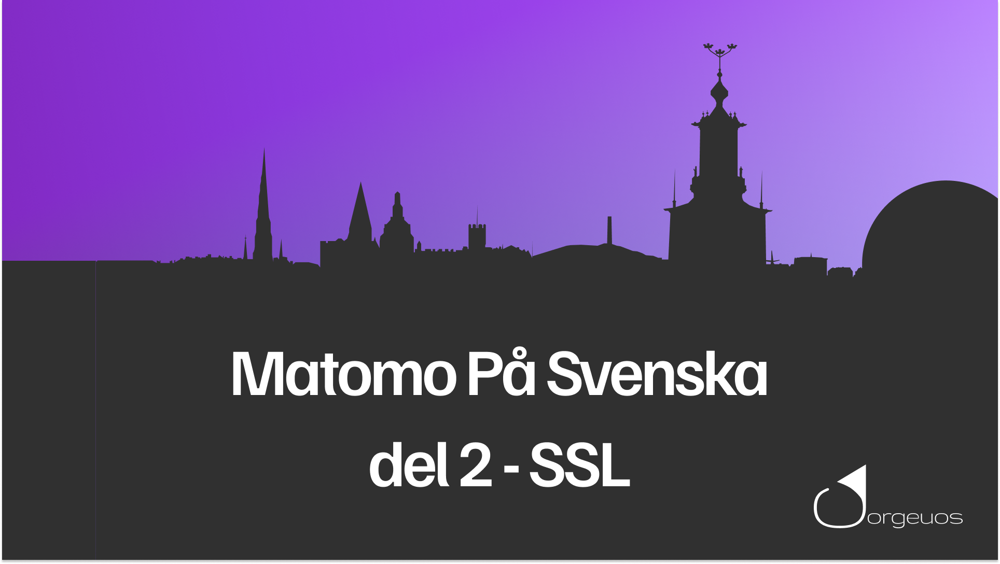

# Fixa till SSL

I första videon så nämnde jag att om man inte har SSL aktiverat för sin Matomo installation. Då kan scriptet bli blockat av webbläsaren för något som heter CSP, Content Security Policy

I den här videon så visar jag hur du åtgärdar det. Dvs installerar ett certifikat på din server.

Följande steg som görs i videon är:

1. Skapa en cert-mapp där vi lagrar våra certifikat.
2. Laddar ner script för att generera certifikat till vår labb-miljö. Jag visar även Let's Encrypt och hur du hittar information om hur du genererar certifikat till din produktions miljö.
3. Se till att din Apache server har aktiverat SSL-modulen.
4. Konfigurerar din Apache-server att lyssna på port 443.
5. Tillåter webbläsaren att acceptera ditt självsignerade certifikat(fungerar endast för labbmiljöer).

Länkar som nämns i videon:
* [Mitt script som genererar ett självsignerat certifikat](https://github.com/jorgeuos/generate-self-signed-cert)
* [Let's Encrypt](https://letsencrypt.org/)
* [Hur du installerar Certbot](https://certbot.eff.org/)

